# MINI SQL Project

## Overview
This is a MINI SQL project implemented in Java, designed to mimic the functionality of MySQL. Instead of using a traditional database server, this project stores all data in files on the local filesystem. It supports querying data, user authentication, and transaction management, providing a lightweight alternative for database operations.

## Features
- **File-based Storage**: Data is persisted in files, allowing for easy backup and portability.
- **Authentication**: Secure login system with success and failure handling (e.g., `login-success`, `login-failed`).
- **SQL-like Queries**: Supports basic SQL commands such as:
  - `CREATE DATABASE` and `CREATE TABLE`
  - `INSERT`, `SELECT`, `UPDATE`, and `DELETE`
  - `SELECT` with column specification and `WHERE` clause
  - Transaction management with `TRANSACTION` and `TRANSACTION ROLLBACK`
- **Error Handling**: Detects and reports incorrect syntax (e.g., `incorrect-syntax`).
- **Logging**: Tracks operations and errors (e.g., `log`).
- **Captcha Integration**: Adds a layer of security during login (e.g., `captcha`).

## Screenshots
Below are screenshots demonstrating the functionality of the MINI SQL project:

### Captcha
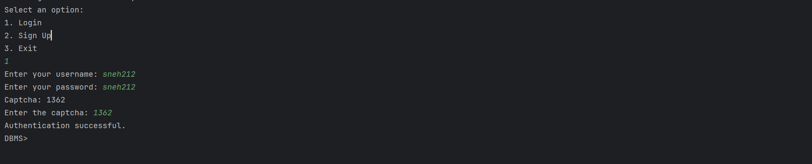
Displays the captcha verification during the login process.

### Create Database
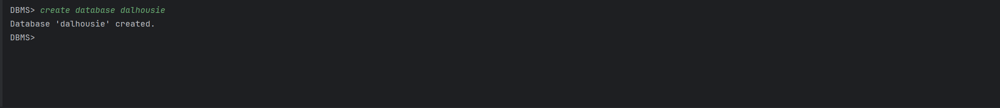
Shows the successful creation of a new database.

### Create Table

Illustrates the creation of a new table within the database.

### Delete
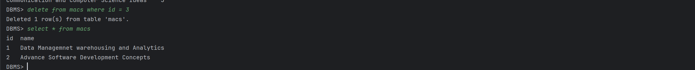
Demonstrates the deletion of data from a table.

### Incorrect Syntax
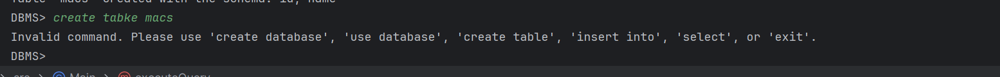
Shows an example of error handling for invalid SQL syntax.

### Insert
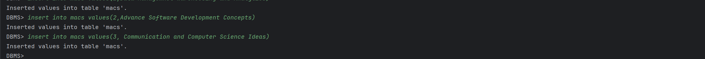
Depicts the insertion of new data into a table.

### Log
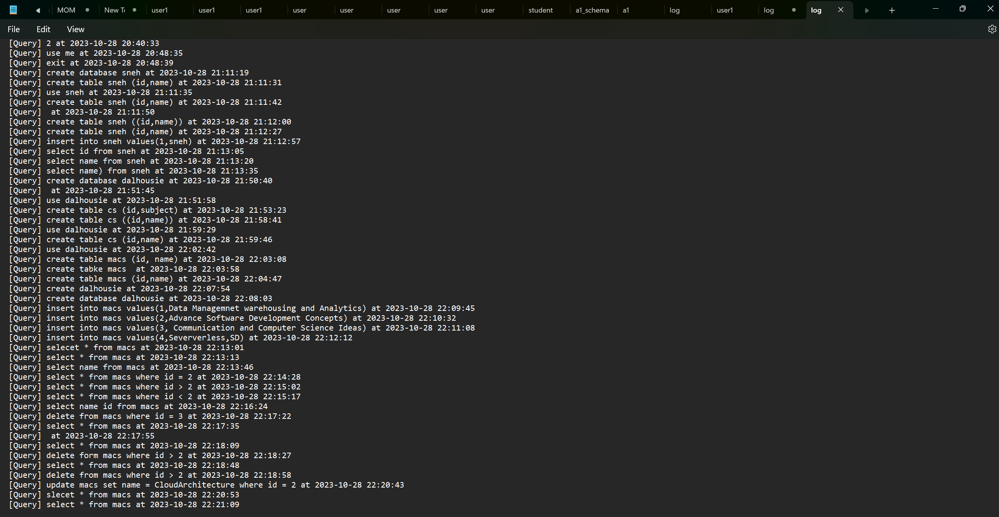
Displays the logging of operations and errors.

### Login
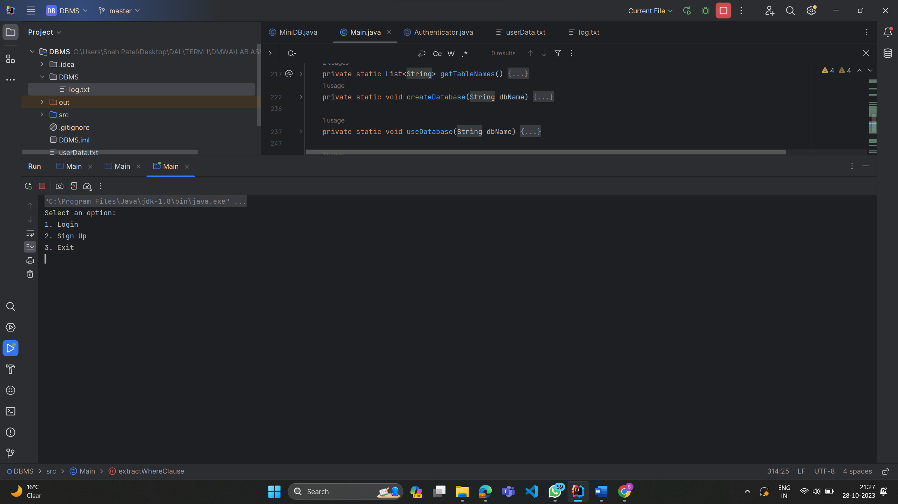
Shows the login interface with authentication.

### Login Failed
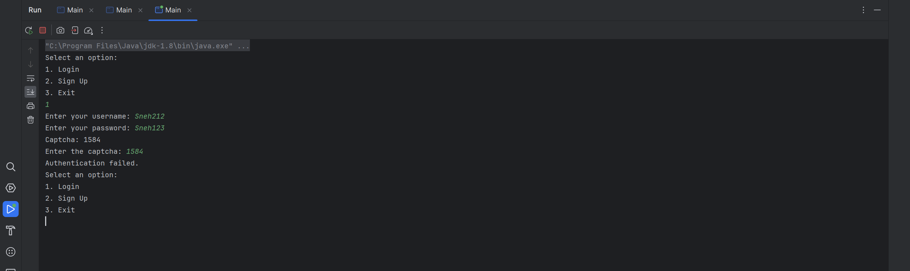
Illustrates a failed login attempt.

### Login Success
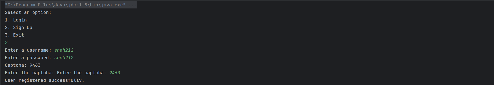
Confirms a successful login.

### Select
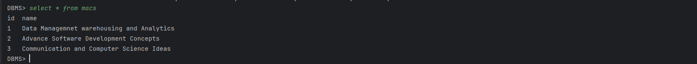
Displays a basic `SELECT` query result.

### Select with Column
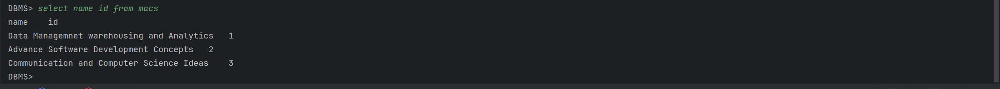
Shows a `SELECT` query with specific columns.

### Select with Where

Demonstrates a `SELECT` query with a `WHERE` clause.

### Transaction
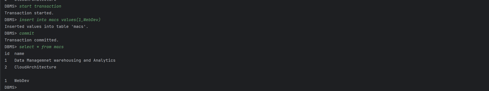
Illustrates the start of a transaction.

### Transaction Rollback
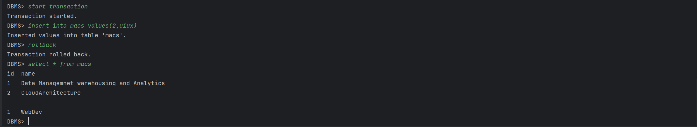
Shows the rollback of a transaction.

### Update
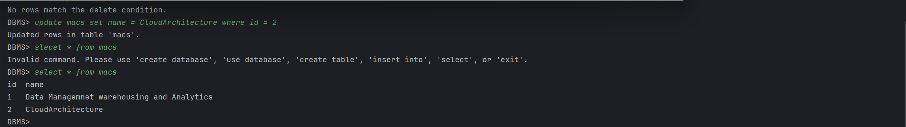
Depicts the updating of existing data.

### Use Database
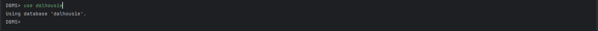
Shows the selection of a database for operations.

## Getting Started

### Prerequisites
- Java Development Kit (JDK) 8 or higher
- An IDE (e.g., IntelliJ IDEA, Eclipse) or a command-line environment

### Installation
1. Clone the repository:
   ```bash
    git clone https://github.com/sneh2102/Mini-MySQL.git
    ```
2. Navigate to the project directory:
    ```bash
    cd mini-sql-project
    ```
3. Compile the Java files:
    ```bash
    javac src/*.java
    ```
4. Run the application:
    ```bash
    java -cp src Main
    ```

### Usage

- Start the application and use the command-line interface to execute SQL-like commands.
- Example commands:

  - `CREATE DATABASE mydb;`
  - `USE mydb;`
  - `CREATE TABLE users (id INT, name VARCHAR(50));`
  - `INSERT INTO users VALUES (1, 'John');`
  - `SELECT * FROM users;`
  - `SELECT * FROM users where id = 1;`
  - `SELECT * FROM users where id > 1;`
  - `SELECT * FROM users where id < 1;`
  - `SELCT name,id from users;`
  - `SELCT name,id from users where id = 6;`
  - `BEGIN TRANSACTION;`
  - `ROLLBACK;`